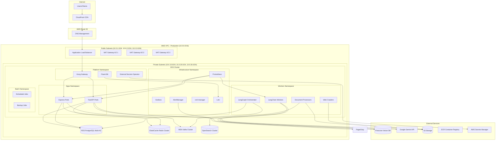
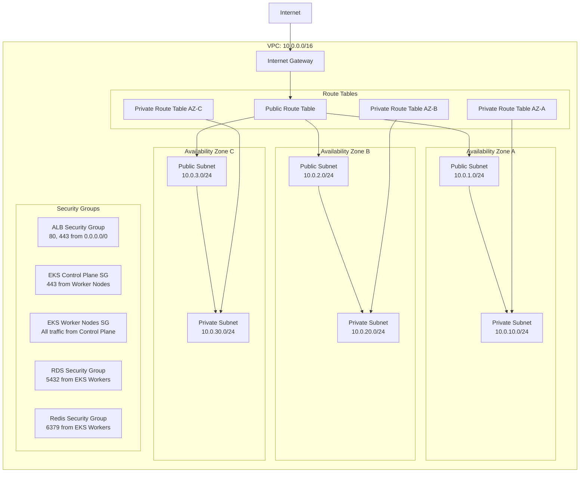
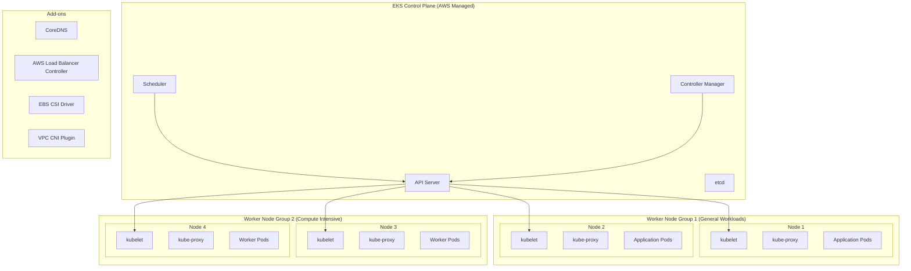
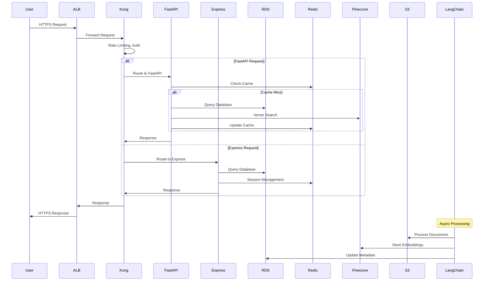
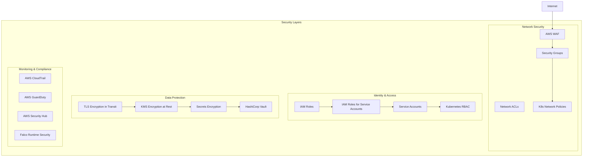
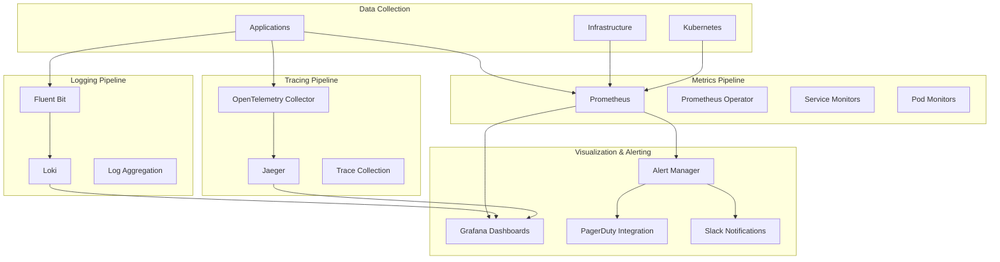
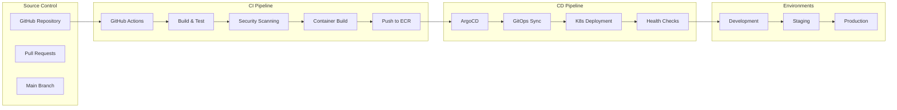
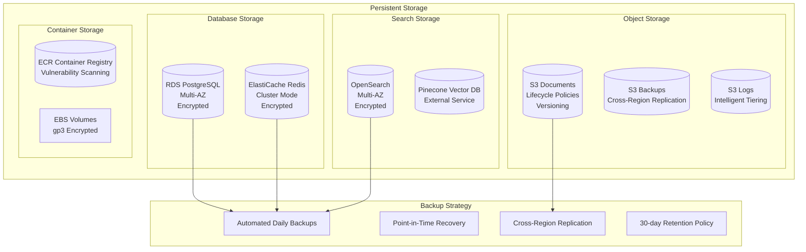
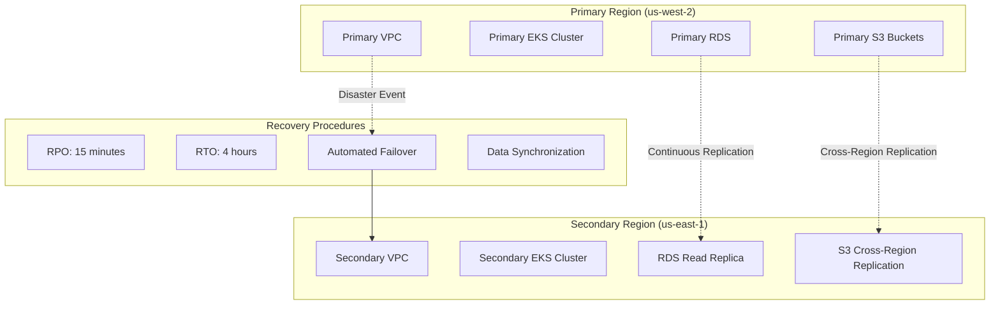

# Architecture Diagrams and System Documentation

## Overview

This document provides comprehensive architecture diagrams and system documentation for the platform infrastructure, including network topology, service interactions, data flow, and security boundaries.

## High-Level System Architecture



## Network Architecture



## Kubernetes Architecture



## Data Flow Architecture



## Security Architecture



## Monitoring and Observability Architecture



## Deployment Pipeline Architecture



## Storage Architecture



## Disaster Recovery Architecture



## Component Specifications

### EKS Cluster Configuration

- **Kubernetes Version**: 1.28
- **Control Plane**: AWS Managed, Multi-AZ
- **Node Groups**:
  - General: m5.large, m5.xlarge (Spot instances)
  - Compute: c5.2xlarge, c5.4xlarge (On-demand)
- **Networking**: VPC CNI, Calico for network policies
- **Storage**: EBS CSI driver, gp3 storage class

### Database Specifications

- **RDS PostgreSQL**:
  - Version: 15.4
  - Instance: db.r6g.large (Multi-AZ)
  - Storage: 100GB gp3, auto-scaling enabled
  - Backup: 30-day retention, automated backups
- **ElastiCache Redis**:
  - Version: 7.0
  - Node Type: cache.r6g.large
  - Configuration: Cluster mode, 3 shards, 1 replica per shard

### Load Balancer Configuration

- **Application Load Balancer**:
  - Scheme: Internet-facing
  - IP Address Type: IPv4
  - Listeners: HTTP (80) → HTTPS (443)
  - SSL Policy: ELBSecurityPolicy-TLS-1-2-2017-01
  - Target Groups: EKS worker nodes

### Security Group Rules

#### ALB Security Group

- **Inbound**:
  - HTTP (80) from 0.0.0.0/0
  - HTTPS (443) from 0.0.0.0/0
- **Outbound**:
  - All traffic to EKS worker nodes

#### EKS Worker Nodes Security Group

- **Inbound**:
  - All traffic from EKS control plane
  - HTTP/HTTPS from ALB security group
  - Node-to-node communication
- **Outbound**:
  - All traffic to 0.0.0.0/0

#### RDS Security Group

- **Inbound**:
  - PostgreSQL (5432) from EKS worker nodes
- **Outbound**:
  - None

### Resource Allocation Guidelines

#### Application Pods

```yaml
FastAPI Pods:
  requests:
    cpu: 250m
    memory: 512Mi
  limits:
    cpu: 1000m
    memory: 1Gi

Express Pods:
  requests:
    cpu: 200m
    memory: 384Mi
  limits:
    cpu: 750m
    memory: 768Mi

LangChain Workers:
  requests:
    cpu: 1000m
    memory: 2Gi
  limits:
    cpu: 4000m
    memory: 8Gi
```

#### Infrastructure Pods

```yaml
Prometheus:
  requests:
    cpu: 500m
    memory: 2Gi
  limits:
    cpu: 2000m
    memory: 8Gi

Grafana:
  requests:
    cpu: 100m
    memory: 128Mi
  limits:
    cpu: 500m
    memory: 512Mi

Fluent Bit:
  requests:
    cpu: 100m
    memory: 128Mi
  limits:
    cpu: 200m
    memory: 256Mi
```

## Scaling Policies

### Horizontal Pod Autoscaler (HPA)

- **FastAPI**: Scale 3-20 pods based on CPU (70%) and memory (80%)
- **Express**: Scale 3-15 pods based on CPU (70%) and memory (80%)
- **LangChain Workers**: Scale 2-10 pods based on CPU (80%) and custom metrics

### Cluster Autoscaler

- **General Node Group**: 1-10 nodes, scale based on pod resource requests
- **Compute Node Group**: 0-8 nodes, scale based on compute-intensive workloads

### Vertical Pod Autoscaler (VPA)

- **Recommendation Mode**: Monitor resource usage patterns
- **Auto Mode**: Automatically adjust resource requests/limits for non-critical workloads

This architecture documentation provides a comprehensive view of the system design, component interactions, and operational considerations for the platform infrastructure.
